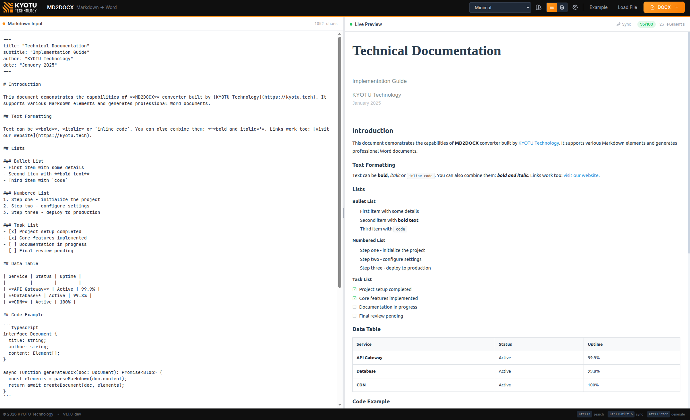

# MD2DOCX

Convert Markdown to professional DOCX, PDF, and HTML — entirely in your browser.

**[→ Open App](https://kyotu-technology.github.io/md2docx/)** — no installation, no sign-up



---

## What it does

Write Markdown, get polished documents. Live preview, syntax highlighting, Mermaid diagrams, custom templates.

- **Export** to DOCX, PDF, or standalone HTML
- **Format** with floating toolbar — bold, italic, code, links (Ctrl+B/I/E/K)
- **Customize** with themes or create your own templates
- **Manage** multiple documents with file explorer and `@include(filename)` composition
- **Share** documents via encrypted URL — password-protected, with optional expiry
- **Diagrams** — copy or download Mermaid diagrams as PNG directly from preview
- **Search** semantically with Ctrl+K (AI-powered, runs locally)
- **Works offline** — everything runs in your browser

## Run locally

```bash
git clone https://github.com/kyotu-technology/md2docx.git
cd md2docx
bun install
bun run dev
```

Open [localhost:3000](http://localhost:3000)

## Testing

End-to-end tests using Playwright + BDD (Gherkin syntax):

```bash
bun run test              # headless (xvfb)
bun run test:headed       # visible browser
bun run test:ui           # Playwright UI mode
bun run test:update-snapshots  # update visual baselines
```

70 scenarios covering export quality (DOCX/HTML/PDF), live preview rendering, formatting toolbar, file explorer, sharing, mermaid diagrams, UI notifications, and visual regression.

## Contributing

1. Fork → 2. Branch → 3. PR

## License

MIT — [KYOTU Technology](https://kyotutechnology.com)

