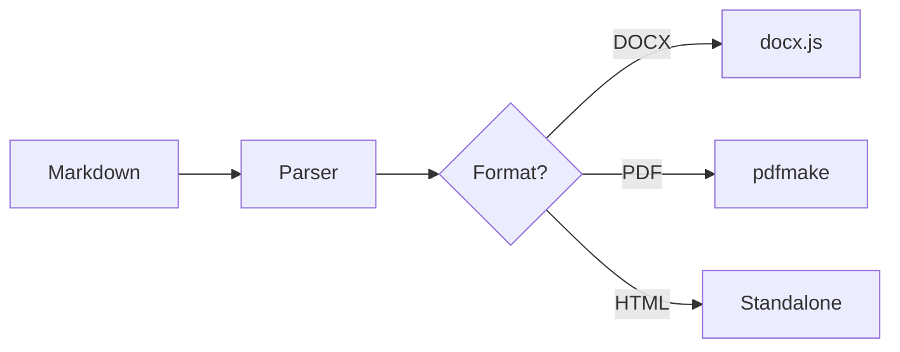

# MD2DOCX

Browser-based Markdown to DOCX/PDF/HTML converter with live preview, syntax highlighting, and Mermaid diagram support.

**[Live Demo](https://kyotu-technology.github.io/md2docx/)** · No installation required

---

## Features

- **Multi-format export** — DOCX, PDF, HTML (print-ready)
- **Live preview** — Real-time rendering as you type with scroll sync
- **Syntax highlighting** — 190+ languages via highlight.js
- **Mermaid diagrams** — Flowcharts, sequence diagrams, etc.
- **YAML frontmatter** — Title, author, date, TOC customization
- **Themes** — KYOTU branded or minimal clean style
- **Custom logo** — Upload your own for branded documents
- **AI semantic search** — Find sections by meaning with Ctrl+K (powered by BGE embeddings)
- **Quality score** — Real-time readability analysis with Flesch-Kincaid metrics
- **Auto-save** — Content persisted in localStorage
- **Offline-capable** — Works entirely in the browser

## Quick Start

Visit **[kyotu-technology.github.io/md2docx](https://kyotu-technology.github.io/md2docx/)** and start typing.

Or run locally:

```bash
git clone https://github.com/kyotu-technology/md2docx.git
cd md2docx
bun install
bun run dev
```

## Usage

### Frontmatter

```yaml
---
title: Project Documentation
author: Your Name
date: 2025-01-31
toc-title: Contents
---
```

### Supported Markdown

| Element | Syntax |
|---------|--------|
| Headings | `# H1` through `#### H4` |
| Emphasis | `**bold**`, `*italic*`, `***both***` |
| Code | `` `inline` `` and fenced blocks with language |
| Lists | Bullet, numbered, and `- [x]` task lists |
| Tables | Pipe-delimited with header row |
| Links | `[text](url)` |
| Diagrams | ` ```mermaid ` code blocks |

### Mermaid Example

````markdown

````

## Export Options

Toggle in the settings panel (⚙️):

| Option | Default | Description |
|--------|---------|-------------|
| Title Page | On | Cover page with metadata |
| Table of Contents | On | Auto-generated from headings |
| Header | On | Logo in document header |
| Footer | On | Page numbers, company info |

## Development

### Prerequisites

- [Bun](https://bun.sh/) v1.0+ (or Node.js 18+)

### Commands

```bash
bun run dev      # Start dev server at localhost:3000
bun run build    # Production build to dist/
bun run lint     # Run ESLint
bun run format   # Run Prettier
```

### Project Structure

```
md2docx/
├── index.html              # Main app shell
├── build.js                # Bun build script
├── src/
│   ├── main.js             # App entry, UI logic
│   ├── parser.js           # Markdown → AST
│   ├── docx-renderer.js    # AST → DOCX
│   ├── pdf-renderer.js     # AST → PDF
│   ├── html-export.js      # AST → standalone HTML
│   ├── html-preview.js     # AST → preview HTML
│   ├── highlighter.js      # Code syntax highlighting
│   ├── mermaid.js          # Diagram rendering via Kroki
│   ├── scroll-sync.js      # Editor ↔ preview scroll sync
│   ├── inline-formatting.js # Shared inline markdown parser
│   ├── logo.js             # Logo handling (SVG→PNG)
│   ├── ai/                 # AI features (search, readability)
│   └── themes/
│       ├── kyotu.js        # KYOTU branded theme
│       └── minimal.js      # Clean minimal theme
└── assets/                 # Logos, favicon
```

## Tech Stack

| Component | Library |
|-----------|---------|
| DOCX generation | [docx](https://github.com/dolanmiu/docx) |
| PDF generation | [pdfmake](https://pdfmake.github.io/docs/) |
| Syntax highlighting | [highlight.js](https://highlightjs.org/) |
| Diagrams | [Kroki.io](https://kroki.io/) |
| AI search | [@huggingface/transformers](https://huggingface.co/docs/transformers.js) (BGE-small-en) |
| Styling | [Tailwind CSS](https://tailwindcss.com/) (Play CDN) |
| Build | [Bun](https://bun.sh/) |

## CI/CD

- **Pull requests** — ESLint, build verification, CodeQL security scan
- **Releases** — Auto-deploy to GitHub Pages with version tag

## Contributing

1. Fork the repo
2. Create a feature branch
3. Make your changes
4. Submit a PR

## License

MIT — see [LICENSE](LICENSE)

---

Built by [KYOTU Technology](https://kyotutechnology.com)
